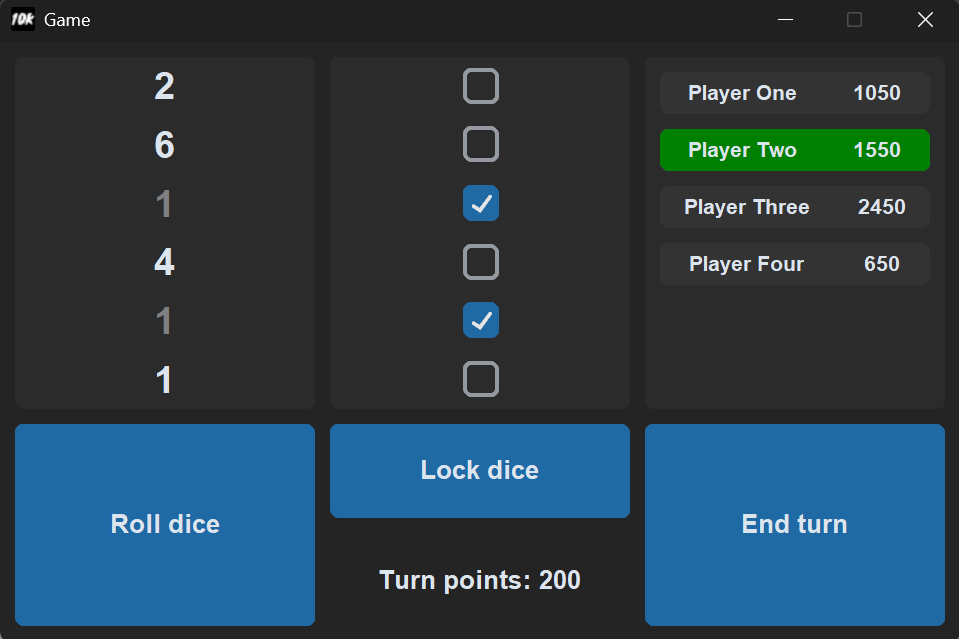

# 10K Game (aka, "Farkle")

10K is a simple dice game about risk management and luck. In this game you roll dice, find combinations and score points while trying not to get too greedy.

This is our attempt at creating the game in python for the Sockathon event organized by [Hack Club](https://hackclub.com/).

## Installation

These are the installation instructions for windows as the games hasn't been tested on Linux and Mac:

1. Download the [latest release](https://github.com/Kre0ns/10k-game/releases/latest).
2. Extract the zip file.
3. Make sure that the `_internal` folder is next to `10K Game.exe` or else it wont work.
4. Run `10K Game.exe`. 

Windows may warn you that the exe is from an unknown publisher, you can just ignore it. If you are concerned you can always go over the source code.

## Rules

If you look up the rules, you will find that there are many different variations and house rules. This means you will probably find that our rules are different from the ones you play by.

Here is our version of the rules:

### Objective

Be the player with the most points at the end of the **final turn**.

### Gameplay

1. **Starting your turn**
   *  Roll all dice.
2. **Continue or Bank Your Points**
   * After each roll, choose at least one die to set aside.
   * You may either:
        * Bank your points and end your turn.
        * Roll the remaining dice to try and earn more points.
   * **Risk:** If a subsequent roll yields no scoring dice, you lose the points accumulated during that turn.

### Winning the game

The first player to **reach or exceed 10,000** points will trigger the **final round**, this round gives the other players one last chance to win. When the final round ends the winner is declared, the winner being the person with the most points.

## Scoring chart

Like we explained in the rules section, there are many variations of the scoring system. This is ours:

| Roll/Combination       | Score                       |
| ---------------------- | --------------------------- |
| Single 1               | 100                         |
| Single 5               | 50                          |
| Three 1s               | 1000                        |
| Three 2s               | 200                         |
| Three 3s               | 300                         |
| Three 4s               | 400                         |
| Three 5s               | 500                         |
| Three 6s               | 600                         |
| Four of a kind         | 2 × (three-of-a-kind score) |
| Five of a kind         | 3 × (three-of-a-kind score) |
| Six of a kind          | 4 × (three-of-a-kind score) |
| Straight (1-2-3-4-5-6) | 1500                        |
| Three Pairs            | 1500                        |
| Two Triplets           | 2500                        |
